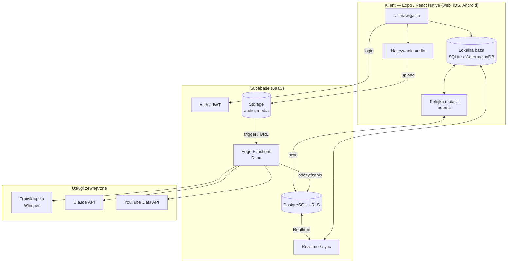
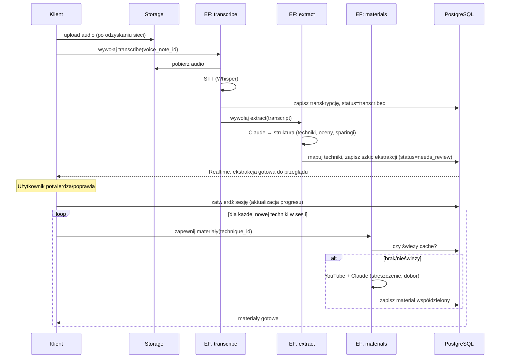

# 04 — Architektura techniczna

## 1. Przegląd

System składa się z czterech warstw:

1. **Klient** — jedna aplikacja Expo / React Native (TypeScript) renderowana na
   web, iOS i Android.
2. **Backend jako usługa (BaaS)** — Supabase: PostgreSQL, Auth, Storage, Realtime.
3. **Logika serwerowa** — Supabase Edge Functions (Deno) jako bezpieczny pośrednik
   do usług AI i zewnętrznych API (klucze nigdy nie trafiają do klienta).
4. **Usługi zewnętrzne** — model transkrypcji (Whisper), Claude API (ekstrakcja,
   streszczenia, dobór materiałów), YouTube Data API (wyszukiwanie/metadane wideo).



## 2. Stos technologiczny

| Warstwa | Technologia | Uzasadnienie (skrót) |
|---------|-------------|----------------------|
| Język | TypeScript (`strict`) | Jedno źródło typów dla web/mobile/backend |
| Framework UI | Expo + React Native | Jeden kod na web+iOS+Android; szybki dev (EAS, OTA) |
| Nawigacja | Expo Router | Routing plikowy spójny web/mobile |
| Stan serwera | TanStack Query | Cache, ponawianie, integracja z offline |
| Stan UI | Zustand | Lekki, prosty stan lokalny |
| Lokalna baza | WatermelonDB (SQLite) | Wydajna baza offline-first z obserwowalnością |
| Formularze/walidacja | React Hook Form + Zod | Walidacja współdzielona z kontraktami AI |
| Backend | Supabase | Postgres + Auth + Storage + Realtime + Edge Functions w jednym |
| Logika serwerowa | Edge Functions (Deno) | Bezpieczny pośrednik do AI/integracji |
| Wykresy | Victory Native / Recharts | Wykresy progresu spójne web/mobile |
| AI: transkrypcja | Whisper (API lub self-host) | Dobra jakość PL; patrz [07](07-pipeline-ai.md) i [14](14-decyzje-architektoniczne.md) |
| AI: rozumienie | Claude API | Ekstrakcja strukturalna, streszczenia, dobór materiałów |
| Wideo | YouTube Data API v3 | Wyszukiwanie i metadane materiałów |
| Monitoring | Sentry | Błędy klienta i funkcji |
| CI/CD | EAS Build/Submit + GitHub Actions | Buildy i wdrożenia |

> Pełne uzasadnienia i rozważane alternatywy → [14 — Rejestr decyzji](14-decyzje-architektoniczne.md).

## 3. Organizacja kodu (monorepo)

```
/                      (monorepo — pnpm workspaces + Turborepo)
├─ apps/
│  └─ app/             # aplikacja Expo (web + iOS + Android)
│     ├─ app/          # ekrany (Expo Router)
│     ├─ components/   # komponenty UI
│     ├─ features/     # moduły domenowe (treningi, techniki, progres, nauka)
│     └─ db/           # WatermelonDB: modele, schema, migracje, sync
├─ packages/
│  ├─ core/            # typy domenowe, walidacja Zod, logika niezależna od UI
│  ├─ ui/              # design system (komponenty współdzielone)
│  └─ api-types/       # typy generowane z Supabase (źródło prawdy)
├─ supabase/
│  ├─ migrations/      # migracje SQL (wersjonowany schemat)
│  ├─ functions/       # Edge Functions (transcribe, extract, materials, sync-helpers)
│  └─ seed/            # dane startowe: słownik technik, dyscypliny
└─ docs/               # ta dokumentacja
```

Zasada: **logika domenowa w `packages/core`** (czysty TS, testowalna), UI cienkie,
backend operuje na tych samych typach (generowanych z bazy).

## 4. Komponenty i odpowiedzialności

### 4.1 Klient
- **Warstwa danych offline-first:** wszystkie odczyty z lokalnej bazy (SQLite via
  WatermelonDB); zapisy zapisują lokalnie i dodają wpis do outboxu.
- **Silnik synchronizacji:** wysyła zmiany z outboxu, pobiera zmiany serwera,
  rozwiązuje konflikty (patrz [10](10-offline-sync.md)).
- **Nagrywanie audio:** zapis pliku lokalnie + wpis „voice_note” ze statusem
  `pending`; upload i przetwarzanie po sieci.
- **Prezentacja AI:** ekran przeglądu ekstrakcji z edycją i poziomami pewności.

### 4.2 Supabase
- **PostgreSQL + RLS:** trwałe dane, izolacja per użytkownik, słownik technik
  globalny (tylko-odczyt dla klienta).
- **Auth:** e-mail/hasło + OAuth (v1); JWT używany przez RLS i Edge Functions.
- **Storage:** pliki audio i media; dostęp przez podpisane URL-e.
- **Realtime:** strumień zmian do klientów (sync, materiały gotowe).
- **Edge Functions:** patrz niżej.

### 4.3 Edge Functions (logika serwerowa)
| Funkcja | Zadanie |
|---------|---------|
| `transcribe` | Pobiera audio ze Storage, woła STT, zapisuje transkrypcję, ustawia status. |
| `extract` | Przekazuje transkrypcję do Claude, waliduje wynik (Zod), mapuje techniki przez słownik, tworzy szkic sesji. |
| `materials` | Dla techniki bez świeżego cache: woła YouTube + Claude (streszczenie, punkty, dobór), zapisuje materiał współdzielony. |
| `link-validate` | Cyklicznie sprawdza martwe linki wideo i odświeża. |
| `account-delete` | Realizuje usunięcie konta i danych (RODO). |

Przepływ przetwarzania notatki (orkiestracja):



## 5. Strategia danych: offline-first

- **Źródłem prawdy dla UI jest baza lokalna.** Serwer jest źródłem prawdy dla
  trwałości i współdzielenia.
- **Zapisy:** optymistyczne — najpierw lokalnie, potem sync.
- **Dane globalne (słownik technik, materiały):** replikowane do klienta jako
  tylko-odczyt; aktualizowane przez Realtime/pull.
- **Audio:** lokalnie do potwierdzenia uploadu; potem opcjonalnie kasowane.

Szczegóły algorytmu i konfliktów → [10 — Offline-first i synchronizacja](10-offline-sync.md).

## 6. Granice bezpieczeństwa

- Klient **nigdy** nie posiada kluczy do Claude/YouTube/STT — woła wyłącznie Edge
  Functions, które autoryzują żądanie po JWT użytkownika.
- RLS wymusza, że każde zapytanie do danych prywatnych jest ograniczone do
  `auth.uid()`.
- Storage audio dostępne tylko przez podpisane URL-e o krótkim czasie życia.

Szczegóły → [11 — Bezpieczeństwo i prywatność](11-bezpieczenstwo-prywatnosc.md).

## 7. Środowiska

| Środowisko | Cel | Uwagi |
|------------|-----|-------|
| `local` | Rozwój | Supabase CLI lokalnie, klucze testowe AI |
| `staging` | Testy przedprodukcyjne | Osobny projekt Supabase, dane testowe |
| `production` | Produkcja | Limity AI, monitoring, backupy |

Konfiguracja przez zmienne środowiskowe i Expo `app.config`; sekrety w Supabase
i EAS Secrets (nigdy w repo).

## 8. Skalowanie w przyszłości (gdy wielu użytkowników)

- Współdzielony cache materiałów rośnie z liczbą **unikalnych technik**, nie
  użytkowników → koszt AI rośnie sublinearnie.
- Ciężkie zapytania pulpitu → widoki zmaterializowane / tabele agregatów
  odświeżane wyzwalaczami.
- Kolejkowanie zadań AI (gdy ruch rośnie) → tabela zadań + worker/cron zamiast
  wywołań synchronicznych.
- Dzielenie z trenerem (v2) → dodatkowe polityki RLS na bazie tabel `memberships`
  (już przewidziane w [05](05-model-danych.md)).
