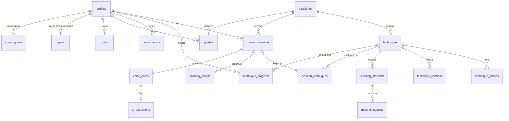

# 05 — Model danych

Baza: PostgreSQL (Supabase). Konwencja: `snake_case`, tabele w liczbie mnogiej,
klucze główne `uuid` (`gen_random_uuid()`), znaczniki `created_at`/`updated_at`
(UTC), kolumny synchronizacyjne `version` (bigint) i `deleted_at` (miękkie
usuwanie) dla encji edytowalnych offline.

## 1. Podział danych

- **Dane globalne (współdzielone, tylko-odczyt dla klienta):** `disciplines`,
  `techniques`, `technique_aliases`, `technique_relations`, `learning_materials`,
  `material_sources`.
- **Dane użytkownika (prywatne, RLS po `user_id`):** `profiles`,
  `training_sessions`, `session_techniques`, `sparring_rounds`,
  `technique_progress`, `body_metrics`, `grades`, `voice_notes`, `ai_extractions`,
  `goals`, `user_technique_notes`, `material_feedback`.
- **Dane współpracy (v2, projektowane teraz):** `gyms`, `memberships`,
  `share_grants`.

## 2. Diagram ERD



## 3. Tabele globalne

### `disciplines`
```sql
create table disciplines (
  id          uuid primary key default gen_random_uuid(),
  code        text not null unique,          -- BJJ, MMA, BOX, MT, KB
  name_pl     text not null,
  name_en     text not null,
  is_grappling boolean not null default false,
  created_at  timestamptz not null default now()
);
```

### `techniques` (kanoniczny słownik — rdzeń produktu)
```sql
create table techniques (
  id            uuid primary key default gen_random_uuid(),
  discipline_id uuid not null references disciplines(id),
  name_pl       text not null,
  name_en       text not null,
  slug          text not null unique,         -- np. rear-naked-choke
  category      text not null,                -- duszenie | dźwignia | obalenie | pozycja | uderzenie | kopnięcie | klincz ...
  position      text,                         -- np. plecy, gard, mount, klincz
  gi_context    text not null default 'both', -- gi | no-gi | both | n/a
  description   text,
  is_official   boolean not null default true,-- false dla technik tworzonych przez użytkownika (gdy user_id ustawione)
  created_by    uuid references profiles(id), -- null = oficjalna/globalna
  created_at    timestamptz not null default now()
);
create index on techniques (discipline_id, category);
```

> Pełna taksonomia kategorii i przykłady → [06 — Słownik technik](06-slownik-technik.md).

### `technique_aliases` (mapowanie slangu/synonimów — klucz do auto-tagowania)
```sql
create table technique_aliases (
  id           uuid primary key default gen_random_uuid(),
  technique_id uuid not null references techniques(id) on delete cascade,
  alias        text not null,                 -- "RNC", "mata leão", "duszenie zza pleców"
  lang         text not null default 'pl',    -- pl | en | other
  normalized   text not null,                 -- alias po normalizacji (lower, bez ogonków) do dopasowania
  source       text not null default 'seed',  -- seed | ai | user
  created_at   timestamptz not null default now()
);
create index on technique_aliases (normalized);
```

### `technique_relations`
```sql
create table technique_relations (
  id            uuid primary key default gen_random_uuid(),
  from_id       uuid not null references techniques(id) on delete cascade,
  to_id         uuid not null references techniques(id) on delete cascade,
  relation      text not null,    -- variant_of | counter_to | transition_to | setup_for
  created_at    timestamptz not null default now(),
  unique (from_id, to_id, relation)
);
```

### `learning_materials` (cache współdzielony — generowany przez AI)
```sql
create table learning_materials (
  id            uuid primary key default gen_random_uuid(),
  technique_id  uuid not null references techniques(id) on delete cascade,
  summary       text not null,                -- streszczenie AI
  key_points    jsonb not null default '[]',  -- punkty kluczowe
  common_errors jsonb not null default '[]',  -- typowe błędy
  lang          text not null default 'pl',
  model         text,                         -- model AI użyty do generacji
  generated_at  timestamptz not null default now(),
  expires_at    timestamptz,                  -- po tej dacie rewalidacja
  unique (technique_id, lang)
);
```

### `material_sources` (konkretne materiały wideo)
```sql
create table material_sources (
  id            uuid primary key default gen_random_uuid(),
  material_id   uuid not null references learning_materials(id) on delete cascade,
  provider      text not null default 'youtube',
  external_id   text not null,                -- id wideo
  url           text not null,
  title         text,
  channel       text,
  duration_s    int,
  thumbnail_url text,
  rank          int not null default 0,       -- kolejność proponowania
  ai_reason     text,                         -- czemu AI wybrało ten materiał
  is_valid      boolean not null default true,-- link żywy?
  last_checked  timestamptz,
  created_at    timestamptz not null default now()
);
create index on material_sources (material_id, rank);
```

## 4. Tabele użytkownika

### `profiles` (rozszerza `auth.users`)
```sql
create table profiles (
  id            uuid primary key references auth.users(id) on delete cascade,
  display_name  text,
  units         text not null default 'metric',  -- metric | imperial
  locale        text not null default 'pl',
  store_audio   boolean not null default true,    -- czy trzymać nagrania po transkrypcji
  ai_monthly_limit_cents int not null default 500, -- limit kosztu AI / mies.
  created_at    timestamptz not null default now(),
  updated_at    timestamptz not null default now()
);
```

### `training_sessions`
```sql
create table training_sessions (
  id            uuid primary key default gen_random_uuid(),
  user_id       uuid not null references profiles(id) on delete cascade,
  discipline_id uuid not null references disciplines(id),
  occurred_at   timestamptz not null,
  duration_min  int,
  session_type  text,                  -- gi | no-gi | technika | drilling | sparingi | worek | tarcze | kondycja ...
  location      text,
  intensity     smallint,              -- 1..10
  feeling       smallint,              -- 1..5
  notes         text,                  -- swobodny opis (też wejście do AI, gdy bez głosu)
  went_well     text,
  went_bad      text,
  created_at    timestamptz not null default now(),
  updated_at    timestamptz not null default now(),
  version       bigint not null default 1,
  deleted_at    timestamptz
);
create index on training_sessions (user_id, occurred_at desc);
```

### `session_techniques` (które techniki w danej sesji + oceny)
```sql
create table session_techniques (
  id            uuid primary key default gen_random_uuid(),
  session_id    uuid not null references training_sessions(id) on delete cascade,
  technique_id  uuid not null references techniques(id),
  user_id       uuid not null references profiles(id) on delete cascade, -- denormalizacja dla RLS/zapytań
  outcome       text,                  -- learned | drilled | worked_in_sparring | failed
  reps          int,
  went_well     text,
  went_bad      text,
  confidence    real,                  -- pewność rozpoznania AI 0..1 (null gdy ręczne)
  source        text not null default 'manual', -- manual | ai
  created_at    timestamptz not null default now(),
  version       bigint not null default 1,
  deleted_at    timestamptz
);
create index on session_techniques (user_id, technique_id);
create index on session_techniques (session_id);
```

### `sparring_rounds`
```sql
create table sparring_rounds (
  id              uuid primary key default gen_random_uuid(),
  session_id      uuid not null references training_sessions(id) on delete cascade,
  user_id         uuid not null references profiles(id) on delete cascade,
  round_no        int,
  duration_min    int,
  partner_label   text,               -- nick/anonimowy opis (FK do opponents w v2)
  partner_level   text,               -- np. pas/poziom przeciwnika
  result          text,               -- win | loss | draw | n/a
  taps_for        int default 0,      -- poddania złapane (ja)
  taps_against    int default 0,      -- poddania oddane (ja)
  finish_technique_id uuid references techniques(id), -- czym zakończono (grappling)
  notes           text,
  created_at      timestamptz not null default now(),
  version         bigint not null default 1,
  deleted_at      timestamptz
);
create index on sparring_rounds (user_id, session_id);
```

### `technique_progress` (opanowanie per użytkownik+technika)
```sql
create table technique_progress (
  id            uuid primary key default gen_random_uuid(),
  user_id       uuid not null references profiles(id) on delete cascade,
  technique_id  uuid not null references techniques(id),
  mastery_level smallint not null default 0,  -- 0 poznana .. 4 działa w sparingu (patrz 06)
  first_seen_at timestamptz,
  last_practiced_at timestamptz,
  practice_count int not null default 0,
  notes         text,
  updated_at    timestamptz not null default now(),
  version       bigint not null default 1,
  unique (user_id, technique_id)
);
```

### `body_metrics`
```sql
create table body_metrics (
  id           uuid primary key default gen_random_uuid(),
  user_id      uuid not null references profiles(id) on delete cascade,
  measured_at  timestamptz not null,
  weight_kg    real,
  resting_hr   int,
  sleep_h      real,
  fatigue      smallint,              -- 1..5 (v1)
  note         text,
  created_at   timestamptz not null default now(),
  version      bigint not null default 1,
  deleted_at   timestamptz
);
create index on body_metrics (user_id, measured_at desc);
```

### `grades` (stopnie/pasy)
```sql
create table grades (
  id            uuid primary key default gen_random_uuid(),
  user_id       uuid not null references profiles(id) on delete cascade,
  discipline_id uuid not null references disciplines(id),
  grade_label   text not null,        -- np. "niebieski pas", "2 stopnie"
  awarded_at    date,
  awarded_by    text,
  note          text,
  created_at    timestamptz not null default now(),
  version       bigint not null default 1
);
```

### `goals`
```sql
create table goals (
  id            uuid primary key default gen_random_uuid(),
  user_id       uuid not null references profiles(id) on delete cascade,
  kind          text not null,        -- frequency | technique_mastery | weight | custom
  target        jsonb not null,       -- np. {"per_week":3} | {"technique_id":"...","level":3}
  due_at        date,
  status        text not null default 'active', -- active | done | abandoned
  created_at    timestamptz not null default now(),
  version       bigint not null default 1
);
```

### `voice_notes` i `ai_extractions`
```sql
create table voice_notes (
  id            uuid primary key default gen_random_uuid(),
  user_id       uuid not null references profiles(id) on delete cascade,
  session_id    uuid references training_sessions(id) on delete set null,
  storage_path  text,                 -- ścieżka w Storage (null gdy tylko tekst)
  duration_s    int,
  transcript    text,
  lang          text default 'pl',
  status        text not null default 'pending', -- pending | uploaded | transcribed | extracted | failed
  error         text,
  created_at    timestamptz not null default now(),
  version       bigint not null default 1
);

create table ai_extractions (
  id            uuid primary key default gen_random_uuid(),
  voice_note_id uuid not null references voice_notes(id) on delete cascade,
  user_id       uuid not null references profiles(id) on delete cascade,
  raw           jsonb not null,        -- surowy, zwalidowany wynik AI
  model         text,
  cost_cents    real,
  status        text not null default 'needs_review', -- needs_review | applied | discarded
  created_at    timestamptz not null default now()
);
```

### `user_technique_notes`, `material_feedback`
```sql
create table user_technique_notes (
  id            uuid primary key default gen_random_uuid(),
  user_id       uuid not null references profiles(id) on delete cascade,
  technique_id  uuid not null references techniques(id),
  body          text not null,         -- własna notatka/link użytkownika
  created_at    timestamptz not null default now(),
  version       bigint not null default 1,
  deleted_at    timestamptz
);

create table material_feedback (
  id            uuid primary key default gen_random_uuid(),
  user_id       uuid not null references profiles(id) on delete cascade,
  source_id     uuid not null references material_sources(id) on delete cascade,
  helpful       boolean not null,
  created_at    timestamptz not null default now(),
  unique (user_id, source_id)
);
```

## 5. Tabele współpracy (v2 — schemat gotowy teraz)

```sql
create table gyms (
  id          uuid primary key default gen_random_uuid(),
  name        text not null,
  owner_id    uuid references profiles(id),
  created_at  timestamptz not null default now()
);

create table memberships (
  id          uuid primary key default gen_random_uuid(),
  gym_id      uuid not null references gyms(id) on delete cascade,
  user_id     uuid not null references profiles(id) on delete cascade,
  role        text not null default 'athlete', -- athlete | coach | owner
  created_at  timestamptz not null default now(),
  unique (gym_id, user_id)
);

-- precyzyjne udostępnienie dziennika konkretnej osobie (np. trenerowi)
create table share_grants (
  id            uuid primary key default gen_random_uuid(),
  owner_id      uuid not null references profiles(id) on delete cascade,
  grantee_id    uuid not null references profiles(id) on delete cascade,
  scope         text not null default 'read',  -- read | comment
  resource      text not null default 'journal',-- journal | sparring | progress
  created_at    timestamptz not null default now(),
  revoked_at    timestamptz,
  unique (owner_id, grantee_id, resource)
);
```

> W MVP te tabele istnieją, ale UI ich nie używa. Pozwala to dodać dzielenie z
> trenerem w v2 bez migracji rozbijającej dane.

## 6. Row Level Security (RLS)

Wzorzec: dane prywatne dostępne tylko właścicielowi; w v2 rozszerzane o
`share_grants`. Przykłady:

```sql
alter table training_sessions enable row level security;

create policy "own sessions - select"
  on training_sessions for select
  using (user_id = auth.uid());

create policy "own sessions - modify"
  on training_sessions for all
  using (user_id = auth.uid())
  with check (user_id = auth.uid());

-- Słownik technik: globalny odczyt, brak zapisu z klienta
alter table techniques enable row level security;
create policy "techniques readable by all authenticated"
  on techniques for select
  using (auth.role() = 'authenticated');

-- v2: trener z aktywnym grantem może czytać sesje podopiecznego
create policy "shared sessions - coach read"
  on training_sessions for select
  using (exists (
    select 1 from share_grants g
    where g.owner_id = training_sessions.user_id
      and g.grantee_id = auth.uid()
      and g.resource in ('journal')
      and g.revoked_at is null
  ));
```

Materiały (`learning_materials`, `material_sources`) — globalny odczyt; zapis
wyłącznie przez Edge Functions (klucz serwisowy, z pominięciem RLS).

## 7. Pola synchronizacji i indeksy

- Każda edytowalna offline tabela ma `version` (inkrementowane przy zapisie),
  `updated_at` i `deleted_at` (miękkie usuwanie) — używane przez silnik sync
  (patrz [10](10-offline-sync.md)).
- Indeksy pod najczęstsze zapytania: listy po `(user_id, occurred_at desc)`,
  wyszukiwanie technik po `normalized` (aliasy), pulpit po agregatach.
- Rozważyć rozszerzenie `pg_trgm` dla wyszukiwania technik po fragmencie nazwy.

## 8. Widoki i agregaty (pulpit)

Dla wydajności pulpitu przy rosnącej liczbie sesji:
- widok zmaterializowany `mv_user_weekly_volume` (treningi/godziny per tydzień),
- widok `v_sparring_summary` (bilans, tapy za/przeciw, finishe),
- odświeżanie wyzwalaczem po `applied` ekstrakcji / edycji sesji lub cyklicznie.

## 9. Dane startowe (seed)

`supabase/seed/` zawiera:
- `disciplines` (BJJ, MMA, BOX, MT, KB),
- startowy zestaw `techniques` + `technique_aliases` (PL/EN, slang) — patrz
  [06 — Słownik technik](06-slownik-technik.md),
- relacje `technique_relations` dla najczęstszych powiązań.
