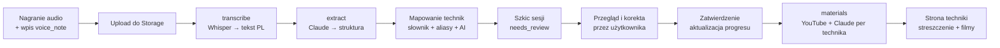
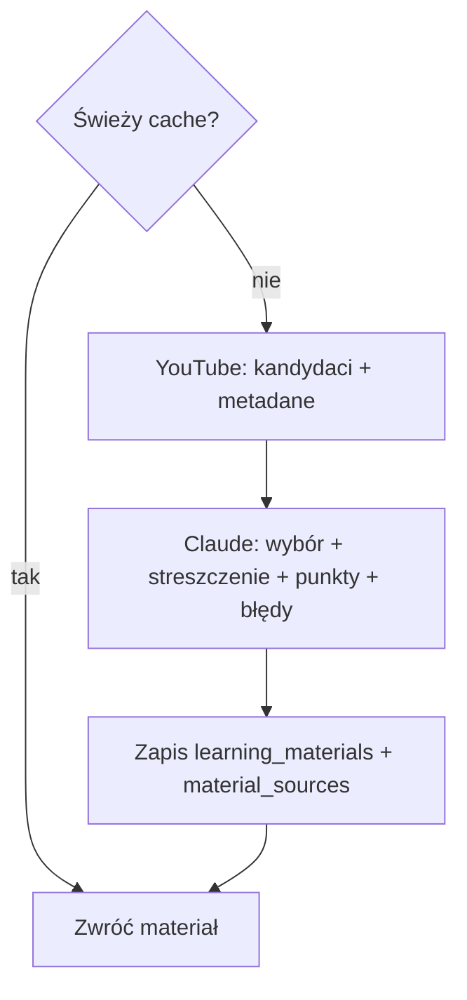

# 07 — Pipeline AI

Pipeline zamienia notatkę głosową na ustrukturyzowaną sesję treningową oraz
materiały do nauki. Działa po stronie serwera (Edge Functions), klucze AI nigdy
nie trafiają do klienta.

## 1. Etapy



Każdy etap jest **odporny na błędy**: porażka jednego nie kasuje danych
poprzedniego, a sesję zawsze da się zapisać ręcznie bez AI (degradacja).

## 2. Etap 1 — Transkrypcja (`transcribe`)

- **Wejście:** `voice_note_id` (audio w Storage), język `pl`.
- **Model:** Whisper (large-v3 lub odpowiednik dający dobrą jakość PL). Wybór
  hostingu (API vs self-host) → [14 — ADR](14-decyzje-architektoniczne.md).
- **Wyjście:** `transcript` (tekst), zapis do `voice_notes`, `status=transcribed`.
- **Uwagi jakości:** zachęta do nagrywania w ciszy po treningu; tekst zawsze
  edytowalny; przechowywanie audio zależne od `profiles.store_audio`.

## 3. Etap 2 — Ekstrakcja (`extract`)

Claude otrzymuje transkrypcję + kontekst (dyscyplina, lista kategorii) i zwraca
**ściśle ustrukturyzowany JSON** zgodny ze schematem (walidacja Zod po stronie
funkcji). Niska temperatura, wymuszony format.

### Schemat wyjścia (kontrakt)
```jsonc
{
  "session": {
    "discipline_code": "BJJ",            // jeśli wywnioskowano
    "session_type": "no-gi",             // jeśli wspomniano
    "duration_min": 75,                  // jeśli wspomniano
    "intensity": 7,                      // 1..10 jeśli wynika z opisu
    "feeling": 4,                        // 1..5 jeśli wynika z opisu
    "summary": "krótkie streszczenie treningu"
  },
  "techniques": [
    {
      "raw_text": "duszenie zza pleców",   // jak powiedział użytkownik
      "guessed_name_pl": "duszenie zza pleców",
      "guessed_name_en": "rear naked choke",
      "category": "duszenie",
      "outcome": "drilled",                // learned|drilled|worked_in_sparring|failed
      "went_well": "kontrola pleców",
      "went_bad": "płaskie wejście pod brodę",
      "confidence": 0.82
    }
  ],
  "sparring": [
    {
      "rounds": 5,
      "result": "n/a",
      "taps_for": 2,
      "taps_against": 1,
      "finish_raw": "trójkąt",
      "notes": "ciężko z większym przeciwnikiem"
    }
  ],
  "body": { "weight_kg": null, "fatigue": 3 },
  "uncertain": ["nazwa techniki X niepewna"]  // elementy do weryfikacji
}
```

### Zasady promptu (skrót)
- Zwracaj **wyłącznie** JSON zgodny ze schematem; brak danych → `null`/pominięcie.
- Nie zgaduj wartości liczbowych, których nie ma w tekście.
- Dla każdej techniki podaj `confidence`; nie znasz polskiej/angielskiej nazwy —
  podaj najlepsze przybliżenie i obniż `confidence`.
- Rozdzielaj „co poszło dobrze” od „co źle” per technika, jeśli to możliwe.

> Pełny prompt systemowy i przykłady „few-shot” trzymamy w
> `supabase/functions/extract/prompts/` i wersjonujemy razem z golden setem.

## 4. Etap 3 — Mapowanie technik na słownik

Dla każdej pozycji z `techniques`:
1. normalizuj `raw_text`/`guessed_name_*` (patrz [06 §4](06-slownik-technik.md)),
2. dopasowanie: dokładny alias → rozmyte (`pg_trgm`) → semantyczne (Claude
   wybiera spośród kandydatów dyscypliny),
3. wynik: `technique_id` + finalne `confidence`,
4. brak dopasowania → utwórz **kandydata techniki** (status do akceptacji) i
   oznacz element jako „do weryfikacji”.

Wynik zapisywany jako `session_techniques` (źródło `ai`, z `confidence`) w
**szkicu** sesji (`ai_extractions.status = needs_review`).

## 5. Etap 4 — Przegląd i zatwierdzenie

- Klient pokazuje szkic: techniki (z poziomem pewności), oceny, sparingi.
- Użytkownik potwierdza/poprawia/odrzuca (WF-VOI-05).
- Po zatwierdzeniu: dane stają się trwałą sesją, aktualizuje się
  `technique_progress` wg reguł z [06 §5](06-slownik-technik.md),
  `ai_extractions.status = applied`.

## 6. Etap 5 — Materiały do nauki (`materials`)

Dla każdej **nowej** techniki w sesji (lub gdy cache nieświeży):

1. **Sprawdź cache** `learning_materials` (per `technique_id` + `lang`). Świeży →
   zwróć od razu (WN-PERF-05, WN-COST-03).
2. **YouTube Data API** — wyszukaj kandydatów (zapytanie budowane z nazwy EN +
   ewentualnie nazwiska znanych instruktorów/kanałów), pobierz metadane
   (tytuł, kanał, długość, miniatura).
3. **Claude** — na podstawie nazwy techniki i listy kandydatów:
   - wybiera 2–4 najlepsze materiały i **uzasadnia wybór** (`ai_reason`),
   - generuje **streszczenie** techniki, **punkty kluczowe**, **typowe błędy**.
4. **Zapis** do `learning_materials` + `material_sources` (współdzielone,
   `expires_at` ustawia okno rewalidacji).



### Walidacja linków (`link-validate`)
Cyklicznie (cron) sprawdza `material_sources.is_valid`; martwe linki → `materials`
dobiera nowe. Feedback użytkownika (`material_feedback`) wpływa na ranking i może
wymusić ponowny dobór.

## 7. Kontrakty i walidacja

- Każde wyjście AI walidowane schematem **Zod** w Edge Function; niezgodność →
  ponów z korektą formatu (1 retry), potem zapisz to, co poprawne i oznacz resztę
  „do weryfikacji”.
- Wartości enumeryczne (`outcome`, `result`, `category`) ograniczone do
  dozwolonych; nieznane → mapowane na `null`/kandydata.

## 8. Koszty i limity

- **Cache materiałów per-technika** → koszt rośnie z liczbą unikalnych technik,
  nie z liczbą użytkowników (WN-COST-03).
- **Limit miesięczny** per użytkownik (`profiles.ai_monthly_limit_cents`) —
  po przekroczeniu pipeline degraduje do trybu „tylko zapis ręczny”.
- **Pomiar:** `ai_extractions.cost_cents`, metryki czasu/pewności (WN-OBS-01).
- **Batchowanie/kolejka:** przy wielu użytkownikach wywołania AI przez tabelę
  zadań + worker (zamiast wywołań synchronicznych).

## 9. Jakość i ewaluacja

- **Golden set:** zbiór realnych transkrypcji PL z oczekiwaną ekstrakcją; testy
  regresyjne przy zmianie promptu/modelu (WN-MAINT-05).
- **Metryki jakości:** odsetek poprawnych tagów technik, odsetek elementów
  wymagających korekty, średnia `confidence` vs trafność.
- **Pętla poprawy:** częste błędne dopasowania → nowe aliasy w słowniku;
  powtarzające się braki → uzupełnienie seeda.

## 10. Prywatność w pipeline

- Do AI trafia minimum: transkrypcja + nazwa techniki/kategorie. Bez danych
  identyfikujących (WN-SEC-04).
- Brak logowania pełnych treści notatek w monitoringu (WN-SEC-06).
- Wybór dostawców AI z opcją regionu/retencji danych → [11](11-bezpieczenstwo-prywatnosc.md).
