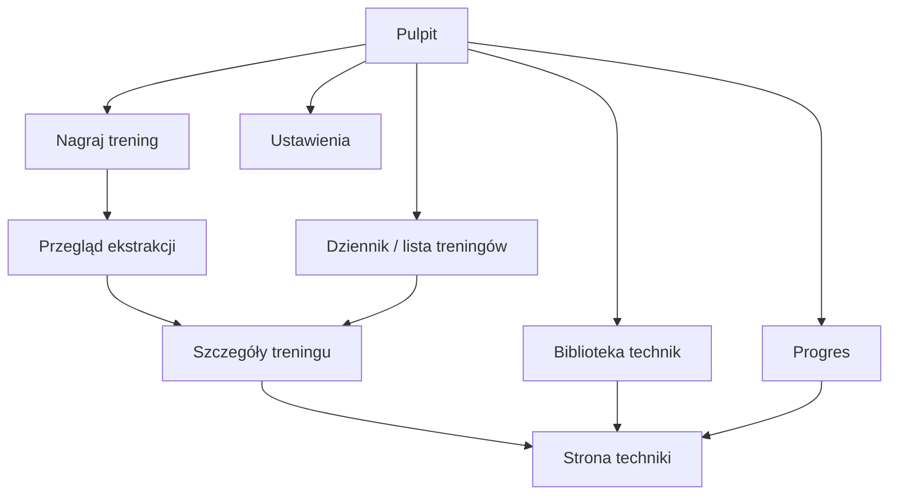

# 09 — Projekt UX

Zasada nadrzędna: **minimalny wysiłek po treningu**. Głos jest pierwszorzędnym
wejściem, formularz jest korektą. Wszystkie kluczowe akcje w zasięgu kciuka.

## 1. Zasady projektowe

- **Najpierw nagraj, potem porządkuj.** Po treningu jedno dotknięcie startuje
  nagrywanie; strukturyzacja dzieje się sama.
- **Zaufanie przez przejrzystość.** Pokazujemy pewność rozpoznania i pozwalamy
  poprawić wszystko.
- **Nauka przyklejona do praktyki.** Z ekranu techniki w treningu masz natychmiast
  materiały.
- **Działa offline.** Każdy stan offline/sync ma jawny, spokojny komunikat.
- **Mniej liczb, więcej wniosków.** Pulpit pokazuje trend i sens, nie tabele.

## 2. Mapa nawigacji

Nawigacja główna: 5 zakładek dolnych (mobile) / boczny pasek (web): **Pulpit,
Dziennik, Nagraj (środek, wyróżniony), Progres, Biblioteka**. Ustawienia w
profilu.

## 3. Kluczowe ekrany

### 3.1 Pulpit (Home)
- Pasek u góry: bieżąca seria (streak), liczba treningów w tym tygodniu.
- Heatmapa aktywności (kalendarz dni treningowych).
- Karta „ostatni trening” + szybki wgląd w to, co poszło dobrze/źle.
- Karta sparingów (bilans, tapy za/przeciw — ostatni okres).
- „Do odświeżenia”: techniki dawno niećwiczone / oznaczone do poprawy.
- Duży przycisk **Nagraj trening**.

### 3.2 Nagraj trening
- Jedno dotknięcie = start nagrywania; widoczny licznik, pauza, stop.
- Po stopie: „Zapisuję…”. Offline → „Zapisano. Przetworzę po połączeniu.”
- Alternatywa: „Wpisz tekstem” (to samo przejście do ekstrakcji).
- Opcjonalne szybkie pola przed/po (dyscyplina, czas) — wstępnie wypełniane z
  historii, można pominąć.

### 3.3 Przegląd ekstrakcji (kluczowy dla zaufania)
- Sekcje: **Techniki**, **Sparingi**, **Sesja** (typ/czas/intensywność), **Notatki**.
- Każda technika: nazwa (PL/EN), kategoria, outcome, „dobrze/źle”, **wskaźnik
  pewności**; elementy o niskiej pewności wyróżnione i na górze.
- Akcje: potwierdź / edytuj / usuń / scal z istniejącą / „to nie technika”.
- Kandydaci nowych technik: „dodaj do słownika” lub „dopasuj do…”.
- CTA: **Zapisz trening** → aktualizacja progresu + dobór materiałów w tle.

### 3.4 Szczegóły treningu
- Nagłówek: data, dyscyplina, typ, czas, intensywność/samopoczucie.
- Lista technik (z odznaką poziomu opanowania) → wejście na stronę techniki.
- Sparingi (rundy, wyniki, tapy, finishe).
- Notatki + (opcjonalnie) odsłuch nagrania / transkrypcja.

### 3.5 Strona techniki (nauka)
- Nazwa PL/EN, dyscyplina, kategoria, pozycja.
- **Streszczenie AI**, **punkty kluczowe**, **typowe błędy**.
- **Materiały wideo** (2–4) z miniaturą, kanałem, długością i „czemu polecane”.
- Twój **postęp** w tej technice (poziom, historia, kiedy ostatnio).
- Twoje notatki/własne linki; powiązane techniki (warianty/kontry/przejścia).
- Akcje: „pomocne/niepomocne”, „dodaj do listy nauki” (v1).

### 3.6 Dziennik (lista treningów)
- Lista chronologiczna z filtrami (dyscyplina, typ, zakres dat).
- Wskaźnik stanu sync per wpis (zsynchronizowany / oczekuje).

### 3.7 Progres
- Frekwencja/wolumen (tydzień/miesiąc), trend.
- Mapa opanowania technik (wg kategorii/pozycji).
- Sparingi: bilans, tapy za/przeciw, najczęstsze finishe (Twoje i przeciwko Tobie).
- Waga (wykres) i historia stopni/pasów.
- Cele i postęp (v1).

### 3.8 Biblioteka technik
- Przeglądanie wg dyscypliny → kategoria → technika.
- Wyszukiwarka (po nazwie/aliasie).
- Wejście na stronę techniki nawet bez treningu (eksploracja nauki).

### 3.9 Ustawienia
- Jednostki, język, dyscypliny, przechowywanie audio, limity AI.
- Eksport danych (v1), usunięcie konta.
- Ekran diagnostyczny sync (oczekujące zmiany, ostatnia synchronizacja).

## 4. Stany (must-have dla każdego widoku)

Każdy ekran ma zaprojektowane: **ładowanie**, **pusto** (z zachętą do akcji),
**błąd** (z możliwością ponowienia), **offline** (jawny, spokojny komunikat),
**przetwarzanie AI** (postęp etapów: transkrypcja → analiza → gotowe).

## 5. Mikrokopie i ton

- Język polski, zwięzły, „trenerski” ale życzliwy.
- Komunikaty offline budują zaufanie: „Bez sieci? Spokojnie — zapiszę i wyślę
  później.”
- Niska pewność AI: „Nie jestem pewien — sprawdź proszę.” (zamiast cichego błędu).

## 6. Design system

- **Komponenty** w `packages/ui`, współdzielone web/mobile.
- **Tryb ciemny** domyślnie wspierany (WN-UX-04).
- **Skala typografii** i odstępy spójne (tokens), kontrast WCAG AA.
- **Ikonografia** spójna (np. zestaw open-source), wyróżniony przycisk „Nagraj”.
- **Dotyk:** główne akcje w dolnej strefie ekranu (zasięg kciuka, WN-UX-02).

## 7. Dostępność

- Etykiety dostępności dla nagrywania i akcji ekstrakcji.
- Rozmiary celów dotykowych ≥ 44×44 pt.
- Wsparcie czytników ekranu (POWINNO), pełna obsługa klawiatury na web.

## 8. Prototyp i walidacja

- Kolejność prototypowania: **Nagraj → Przegląd ekstrakcji → Strona techniki →
  Pulpit** (to ścieżka rdzenia wartości).
- Walidacja na realnych nagraniach autora (golden set) przed dopracowaniem reszty.
