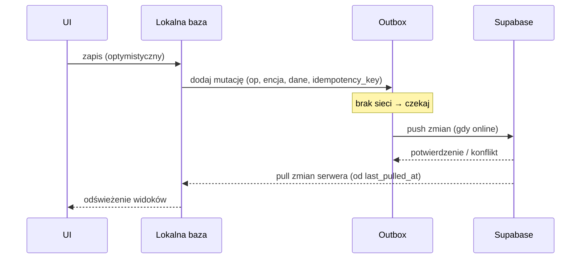

# 10 — Offline-first i synchronizacja

Cel: użytkownik na sali bez zasięgu zapisuje cały trening (łącznie z nagraniem),
a dane bez jego udziału trafiają na serwer po odzyskaniu sieci. Utrata danych
jest niedopuszczalna (WN-REL-01).

## 1. Model danych klienta

- **Lokalna baza:** SQLite przez WatermelonDB — odczyty UI zawsze z lokalnej bazy
  (natychmiastowe, WN-PERF-06).
- **Outbox (kolejka mutacji):** każda zmiana danych użytkownika zapisywana
  lokalnie i dopisywana do kolejki do wysłania.
- **Pola synchronizacji** (w tabelach edytowalnych): `updated_at`, `version`,
  `deleted_at` (miękkie usuwanie).
- **Dane globalne** (słownik, materiały) — replikowane jako tylko-odczyt,
  odświeżane pull/Realtime.

## 2. Cykl synchronizacji

- **Push:** wysyłka mutacji z outboxu w kolejności; każda z `Idempotency-Key`
  (WN-REL-03) — ponowienie nie tworzy duplikatów.
- **Pull:** pobranie zmian serwera od `last_pulled_at` (w tym `deleted_at`).
- **Wyzwalacze sync:** powrót sieci, wznowienie aplikacji, zmiana danych, interwał
  w tle.

## 3. Rozwiązywanie konfliktów

Strategia bazowa: **Last-Write-Wins** na poziomie rekordu z użyciem `version` i
`updated_at`.

- Serwer akceptuje zapis, jeśli `version` klienta == aktualna; inaczej zwraca
  `409` z aktualnym rekordem.
- Klient scala: dla rozłącznych pól — scalenie pól; dla kolizji tego samego pola —
  wygrywa nowszy `updated_at`; przegrana wersja zachowywana lokalnie do wglądu
  (dziennik konfliktów na ekranie diagnostycznym).
- **Encje typu append** (np. `session_techniques`, `sparring_rounds`,
  `body_metrics`) rzadko kolidują — traktowane jako dodrębne wstawki.
- **Usuwanie** zawsze miękkie (`deleted_at`), by sync nie „wskrzeszał” rekordów.

> W razie potrzeby pól o wysokiej kolizyjności (rzadkie tu) rozważyć liczniki/CRDT.
> Dla tej domeny LWW + append jest wystarczające i prostsze (patrz [14 — ADR-006]).

## 4. Audio i pliki

- Nagranie zapisywane lokalnie natychmiast; wpis `voice_notes.status=pending`.
- Po sieci: upload do Storage → `status=uploaded` → wywołanie `transcribe`.
- Plik lokalny trzymany do potwierdzenia uploadu (WN-REL-04); kasowanie zależne
  od `profiles.store_audio`.
- Duże pliki: upload wznawialny; przy błędzie pozostają w kolejce.

## 5. Przetwarzanie AI a offline

- Nagranie offline → kolejka; transkrypcja/ekstrakcja po sieci (asynchronicznie).
- Wynik ekstrakcji wraca przez Realtime; jeśli aplikacja zamknięta — widoczny po
  ponownym otwarciu jako „szkic do przeglądu”.
- Zapis sesji **nie wymaga** AI — można uzupełnić ręcznie offline, a AI dołączy
  dane później (degradacja, WN-REL-02).

## 6. Spójność progresu

- `technique_progress` przeliczany przy zatwierdzeniu sesji. Aby uniknąć rozjazdu
  przy synchronizacji wielu urządzeń, przeliczenie jest **idempotentne** względem
  zbioru `session_techniques` (funkcja czysta: zbiór wystąpień → poziom).
- Alternatywnie agregaty pulpitu liczone po stronie serwera (widoki), klient je
  cache'uje.

## 7. Stany i diagnostyka (UX)

- Globalny wskaźnik: „zsynchronizowano” / „N oczekujących” / „offline”.
- Per rekord: znacznik oczekiwania na ekranie listy.
- Ekran diagnostyczny: liczba mutacji w kolejce, ostatnia synchronizacja,
  dziennik konfliktów, przycisk „synchronizuj teraz”.

## 8. Przypadki brzegowe

| Przypadek | Zachowanie |
|-----------|------------|
| Edycja tej samej sesji na 2 urządzeniach offline | LWW po `updated_at`; przegrana wersja w dzienniku konfliktów |
| Usunięcie na jednym, edycja na drugim | Usunięcie (miękkie) wygrywa, jeśli nowsze; inaczej edycja „wskrzesza” z nowym `version` |
| Upload audio przerwany | Wznowienie; wpis pozostaje `pending`/`uploaded` |
| Limit AI przekroczony offline | Sesja zapisana; po sieci komunikat o limicie, brak ekstrakcji |
| Zmiana słownika technik na serwerze | Pull aktualizuje dane globalne; istniejące powiązania po `technique_id` stabilne |
