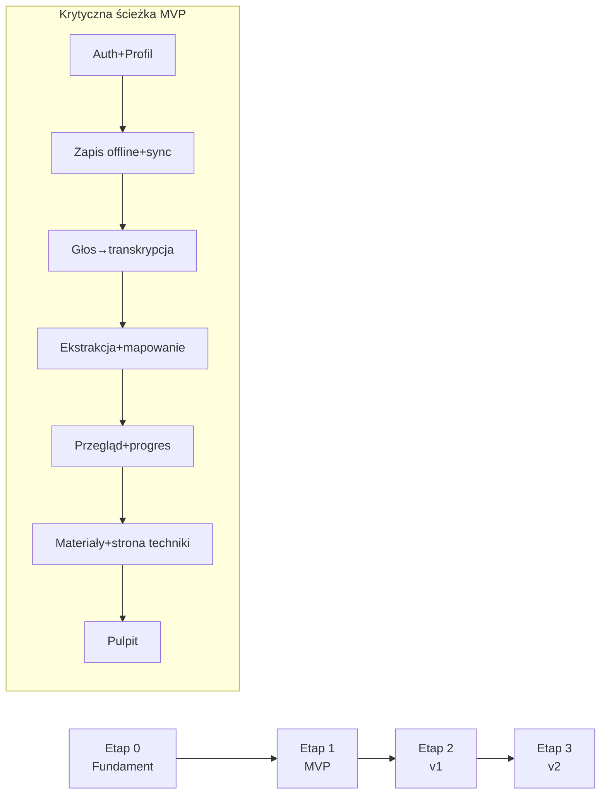

# 12 — Roadmapa

Podejście: dowieźć **rdzeń wartości** (głos → struktura → nauka → progres) jak
najszybciej dla jednego użytkownika (autora), potem rozbudowywać. Twardy podział
etapów chroni przed przeładowaniem zakresu.

## Etap 0 — Fundament (setup)
**Cel:** szkielet, na którym da się budować.
- Monorepo (pnpm + Turborepo), Expo app (web/iOS/Android), TypeScript strict.
- Projekt Supabase (`local`/`staging`/`production`), migracje SQL, RLS bazowe.
- Auth e-mail/hasło; profil.
- WatermelonDB + szkielet sync (push/pull/outbox) na 1 tabeli (pionowy plasterek).
- CI: lint, typy, build EAS, podstawowe testy.

**Kryterium wyjścia:** logowanie działa; jedna encja zapisuje się offline i
synchronizuje; aplikacja uruchamia się na web i telefonie.

## Etap 1 — MVP (rdzeń wartości)
**Cel:** kompletna pętla wartości dla autora.

Zakres (wszystko `[MVP]` z [02](02-wymagania-funkcjonalne.md)):
1. **Zapis treningu** ręczny (formularz) + offline (TRN).
2. **Notatka głosowa** → upload → `transcribe` (Whisper) → transkrypcja (VOI).
3. **Ekstrakcja** `extract` (Claude) + **mapowanie technik** na słownik (VOI/TEC).
4. **Przegląd ekstrakcji** z edycją i pewnością; zatwierdzenie → progres.
5. **Słownik technik** (seed BJJ/MMA/uderzane) + aliasy + kandydaci AI.
6. **Materiały** `materials` (YouTube + Claude), cache współdzielony, strona techniki (LRN).
7. **Progres**: opanowanie, frekwencja/wolumen, heatmapa, sparingi, waga/stopnie (PRG/SPR/BDY).
8. **Pulpit** z najważniejszymi wglądami.
9. **Sync** dojrzały (konflikty, diagnostyka) + stany offline w UI.
10. **Ustawienia** (jednostki, język, audio, limit AI).

**Kryteria wyjścia (Definition of Done MVP):**
- Zapis treningu głosem < 90 s (mediana).
- Rozpoznanie technik ≥ 85% na zdaniach opisujących technikę (golden set).
- Materiały trafne (≥ 4,0/5 subiektywnie) i cache działa.
- Pełne działanie offline + synchronizacja bez utraty danych.
- Koszt AI < 0,05 USD/trening (cel).
- Autor realnie loguje treningi przez ≥ 3 tygodnie bez krytycznych błędów.

## Etap 2 — v1 (dopracowanie i wygoda)
**Cel:** z „działa” w „chcę tego używać codziennie”.
- OAuth Google/Apple; blokada biometryczna.
- Cele (`goals`) i postęp; okresowe podsumowania AI (tydzień/miesiąc).
- Feedback materiałów (pomocne/niepomocne) → lepszy ranking; rewalidacja linków.
- Watchlist nauki; własne notatki/linki rozbudowane.
- Media w sesji (zdjęcia/krótkie wideo).
- Eksport danych (JSON/CSV); usuwanie konta z UI; powiadomienia.
- Relacje technik (warianty/kontry/przejścia) w UI; techniki użytkownika.
- Szyfrowanie lokalnej bazy; dopracowanie dostępności (A11Y).
- Twarde limity/rate-limiting AI; kolejka zadań AI (przygotowanie pod skalę).

**Kryteria wyjścia:** stabilność, retencja własna wysoka, gotowość do wpuszczenia
kilku zaproszonych użytkowników (zamknięta beta).

## Etap 3 — v2 (wielu użytkowników + trener)
**Cel:** produkt dla wielu, ze współpracą.
- Dzielenie dziennika z trenerem (`share_grants`), role/uprawnienia, komentarze.
- Profile przeciwników/partnerów; rozbudowane statystyki sparingowe.
- Planowanie obozów/cykli (kontrola wagi, plan), zaawansowana analityka.
- Społeczność/porównania (opcjonalnie), onboarding dla nowych.
- Przygotowanie do monetyzacji (po walidacji): plan darmowy + płatny (limity AI,
  zaawansowane analizy).
- Polityka prywatności, regulamin, DPA — przed publicznym wydaniem.

**Kryteria wyjścia:** trener widzi i komentuje dziennik podopiecznego; system
stabilny przy wielu kontach; koszty AI pod kontrolą (cache + kolejka).

## Mapa zależności (skrót)

## Zasady priorytetyzacji
- Funkcja wchodzi do MVP tylko jeśli służy rdzeniowi wartości lub niezawodności.
- Wszystko „społecznościowe” czeka do v2, ale model danych jest gotowy od MVP.
- Każdy etap kończy się mierzalnym kryterium wyjścia — bez niego nie idziemy dalej.

> Świadomie pomijamy konkretne daty — kolejność i kryteria wyjścia są ważniejsze
> niż terminy przy projekcie jednoosobowym. Daty dopiszemy, gdy ustalimy tempo
> pracy.
